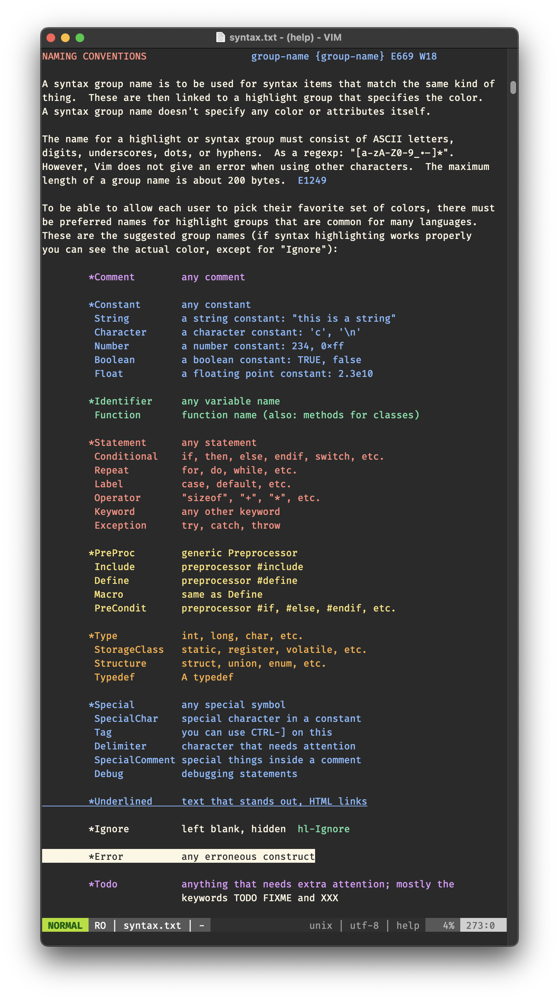

# firefly  🪲


My personal dark vim color scheme with vibrant, but muted colors.

I got tired of looking at pea green strings with [gruvbox](https://github.com/morhetz/gruvbox) and created my own color scheme[^1]: Its vibrant, but muted colors reduce eye strain and help my brain process buggy source code late into the night, hence the name. 
<br />
<table>
  <tr>
    <td align="center">24-bit color</td>
     <td align="center">8-bit color</td>
     <td align="center">4-bit color</td>
  </tr>
  <tr>
    <td align="center", valign="top"></td>
    <td align="center", valign="top"></td>
    <td align="center", valign="top"></td>
  </tr>
 </table>

Firefly's color palette is optimized for Vim's `termguicolors`, but it adjusts seamlessly to reduced terminal colors (`t_Co=256`, `t_Co=16`). See the screenshots in the table above. For best results, consider installing a collection of language packs such as [`vim-polyglot`](https://github.com/sheerun/vim-polyglot).

>[!TIP]
>You can install the Firefly color scheme with [vim-plug](https://github.com/junegunn/vim-plug) - by adding these lines to your `vimrc`:
>```vim
>call plug#begin()
>
>" Firefly - Vim Color Scheme
>Plug 'christianrickert/vim-firefly'
>
>call plug#end()
>```

_I hope you will enjoy Firefly as much as I do!_ 🌙

[^1]: The color scheme files were generated with [vim-colortemplate](https://github.com/lifepillar/vim-colortemplate).
