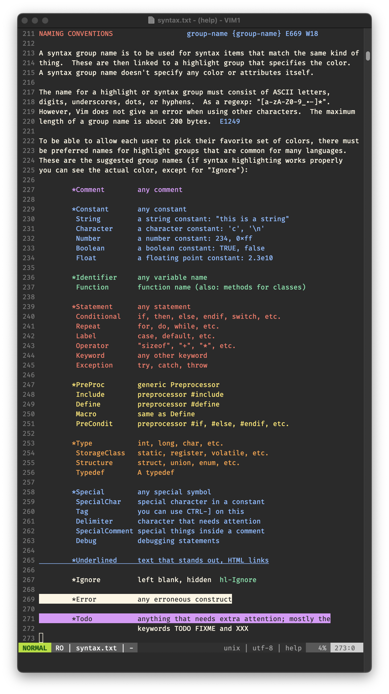

# firefly
Firefly - Vim Color Scheme

My personal (dark) Vim color scheme. Created with [vim-colortemplate](https://github.com/lifepillar/vim-colortemplate)!

<table>
  <tr>
    <td align="center">24-bit color</td>
     <td align="center">8-bit color</td>
     <td align="center">4-bit color</td>
  </tr>
  <tr>
    <td align="center", valign="top"></td>
    <td align="center", valign="top"></td>
    <td align="center", valign="top"></td>
  </tr>
 </table>
